[English Version (英文版)](/posts/podish-technique-report)


# 一个比 iSH 更快的 iOS Linux x86 容器

> **TL;DR**：`Podish` 是一个面向 iOS / Apple Silicon 专门优化的高性能 Linux x86 用户态容器。它用 C++ 写了一个 i686 解释器核心，用 C# 写了 Linux 兼容层，在 iPhone 17 (A19) 上跑出 CoreMark ~3400，比 iSH 快一倍。
>
> Web Demo: https://podish.meokit.com
>
> GitHub: https://github.com/meokit/podish

---

## 项目速览

Podish 的目标：在**禁止 JIT 的 iOS** 上，尽可能高效地运行 x86 Linux 程序。类似 iSH，但代码完全从头重写，并在多个维度上性能翻倍。

### 它能做什么

| 类别               | 代表程序                   | 状态                              |
| :----------------- | :------------------------- | :-------------------------------- |
| Shell / 基础工具链 | `busybox` / `bash` / `vim` | 稳定可用                          |
| 脚本运行时         | `python3` / `LuaJIT`       | 已验证，可稳定跑 benchmark        |
| 构建工具链         | `gcc` / `make`             | 已验证，`make compile` 跑通       |
| 网络 / 开发工具    | `git` / `OpenSSH`          | 手工跑通过，`git clone` 可用      |
| 重型运行时         | `Node.js` / `Gemini CLI`   | 能启动，偶有 crash（V8 JIT 相关） |

### 运行截图

**iPhone 上的终端环境**：

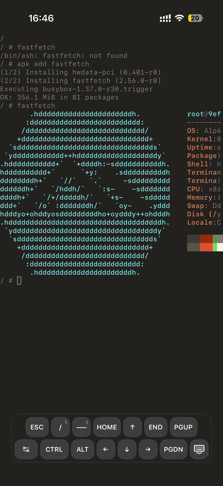

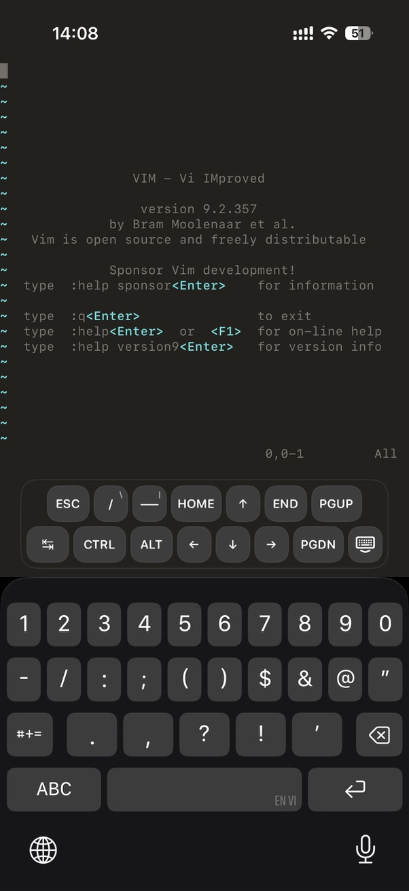

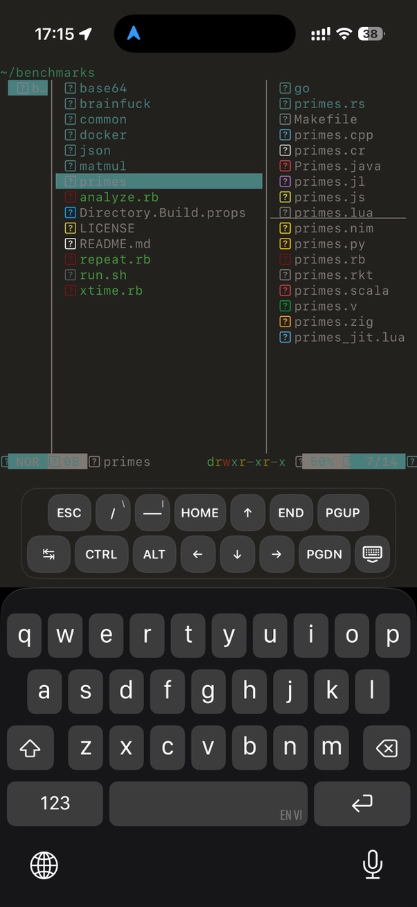

**浏览器演示**（无需安装）：

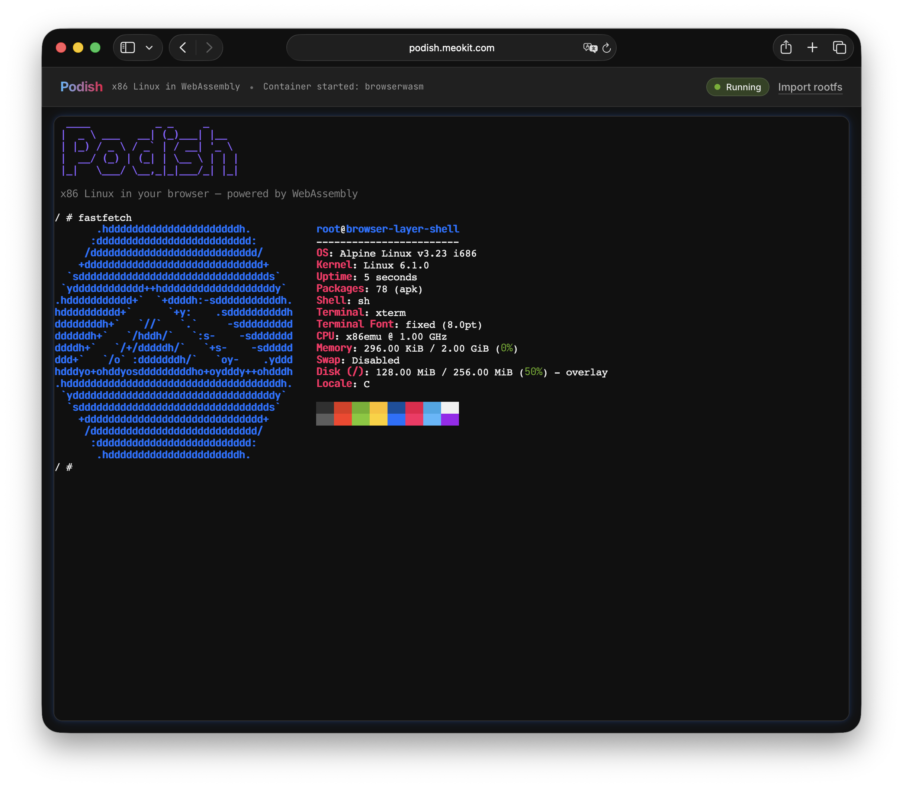

**iPhone 跑 CoreMark**：

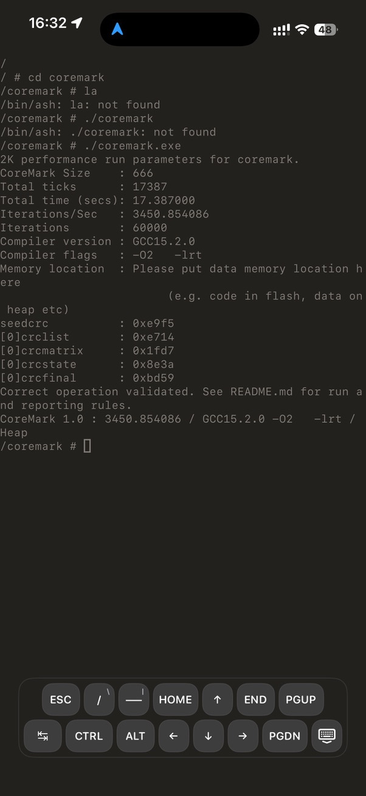

**跑 Gemini CLI**：

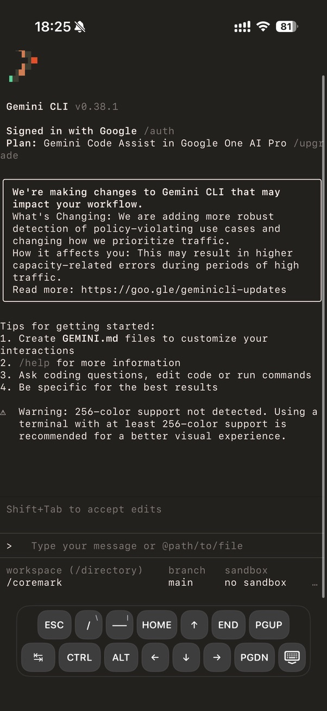

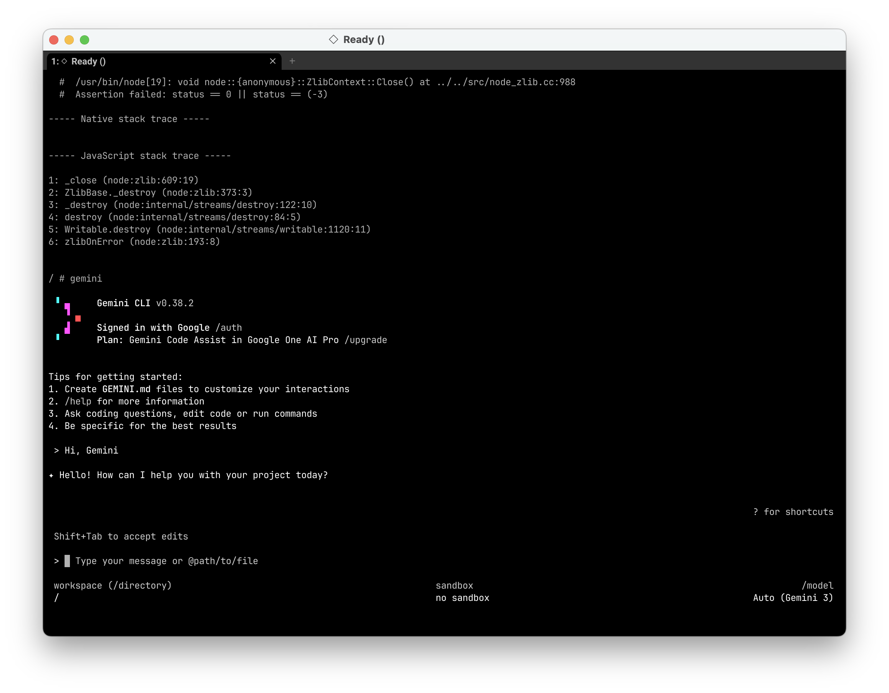

### 性能速览

| Workload                 | Podish (A19) | iSH (A19) |      倍数 |
| :----------------------- | -----------: | --------: | --------: |
| CoreMark 1.0             |     **3447** |      1692 | **~2.0×** |
| `python primes.py`       |       78.3 s |   684.4 s | **~8.7×** |
| `luajit -joff primes`    |       14.5 s |    27.5 s | **~1.9×** |
| `sh -lc true` warm start |        20 ms |     30 ms | **~1.5×** |

_完整基准测试与测试环境说明见文末「[性能数据与优化历程](#性能数据与优化历程)」。_

---

> **以下章节进入技术实现细节。** 如果你只想了解项目现状，上面的速览已经够用了；下面是枯燥的技术细节。

---

## 动机与背景

iOS 上有一个限制：不允许 JIT。具体来说，系统禁止 WX（Write-XOR-Execute）内存页映射，未经签名的代码无法执行。这意味着你无法在 App Store 下载带 JIT 加速的 UTM，只能使用极其缓慢的 UTM SE；也无法运行 LuaJIT 的 JIT 模式。

在这种背景下，我想知道**解释器最快能有多快？** 能否在不做 JIT 的前提下，靠极致的解释器设计和硬件感知优化，逼近 JIT 的性能？

解释器的主要灵感来自于 [LuaJIT Remake](https://github.com/luajit-remake/luajit-remake)。我从它接触到了 Clang 的 `preserve_none`、`preserve_all` 和 `[[musttail]]` 等 ABI 特性——这些工具有可能让编译器生成堪比手写汇编的解释器热路径。

项目从 `hello world` 开始（第一周），到跑通 `CoreMark`（约一个月），再到如今能稳定运行 Busybox、Bash、Python、LuaJIT、GCC，甚至启动 Node.js 和 Gemini CLI。

---

## 整体架构

Podish 并非单层设计，而是采用了明确的分层架构：

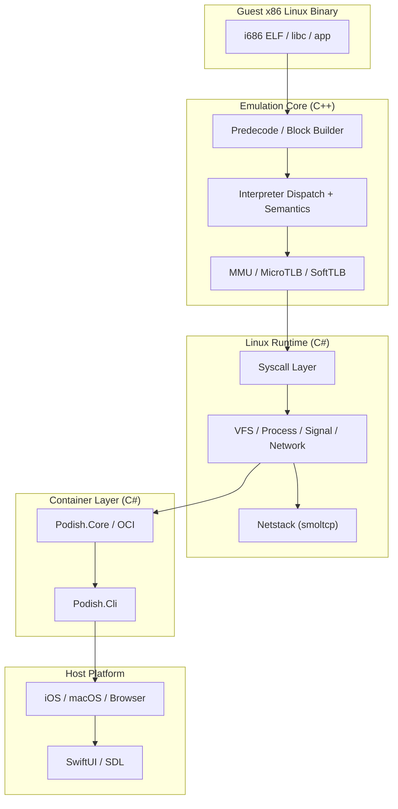

仓库里有：

- `libfibercpu`: C++ 写的 IA-32 emulator core
- `Fiberish.Core`: Linux runtime / kernel compatibility layer
- `Fiberish.Netstack`: 基于 [smoltcp](https://github.com/smoltcp-rs/smoltcp)
- `Podish.Core`: 更上层的 container/runtime orchestration
- `Podish.Cli`: 面向实际使用的 CLI
- SwiftUI / Browser 界面

### 为什么我用C#写系统调用层

**选 C# 的原因**：我需要快速实现约 200 个 Linux syscall 语义、VFS 层、网络栈和容器生命周期管理。C# 的跨平台 IO、字符串处理、异步模型和丰富标准库让我能在一个月内跑出一个shell。如果全程用 C++，我将不得不直接直接对接大量不同系统的 API。

**控制跨语言开销**：为了避免 P/Invoke 成为瓶颈，并简化生命周期管理，我这样做设计：

- **使用 C API**：`libfibercpu` 暴露的完全是 C 风格 API（`X86_Create`, `X86_Run`, `X86_RegRead` 等），C# 端通过 `LibraryImport` / `DllImport` 调用。每个 `EmuState` 在 C# 端仅是一个 `IntPtr`，不会给托管堆带来 GC 压力。
- **大块内存零拷贝**：C# 层不会逐字节通过 P/Invoke 读写guest内存。`bindings.h` 提供了接口，直接返回宿主指针；C# 用 `Span<byte>` 或 `MemoryMarshal` 直接操作。
- **回调方向用 GCHandle Pin**：C++ 侧的 Fault、Interrupt、Log 回调需要持有 C# `Engine` 对象的引用。我通过 `GCHandle.Alloc(this)` 把对象Pin住，把指针作为 `userdata` 传给 C++，避免了跨边界时的 GC 移动问题。
- **只有 syscall 才进入C#**：解释器热路径里，guest 程序本身在 C++ 里连续执行成百上千条指令才触发一次 syscall。真正跨边界的次数取决于 guest 的 syscall 密度，而不是指令密度。

实际 profile 显示，在计算密集型负载（如 CoreMark）中，跨语言边界开销占比不到 1%；在 IO 密集型负载（如 `git clone`）中，瓶颈在网络和 VFS，也不在 P/Invoke。

---

## 解释器设计

解释器的核心目标是：**在不使用 JIT 的前提下，尽可能降低开销**，下面列出几个关键设计。

### 1. 预解码 + Tail-call Dispatch

传统解释器通常有一个中央 dispatch 循环（`while (1) { decode; dispatch; execute; }`），每次执行完一条指令都要回到这个循环。
我选择尽可能简化分发，用尾递归把指令串起来。

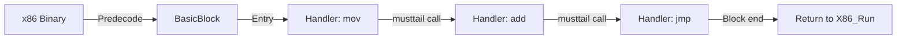

具体做法：

1. **预解码**：先将变长 x86 指令解码成固定长度的中间表示（`DecodedOp`，32 字节），按基本块顺序存放。
2. **Tail-call 链**：每条 IR 自带 handler 函数指针。执行完当前指令后，不回到统一 dispatcher，而是通过 `[[musttail]]` 直接尾调用到下一条指令的 handler。
3. **缓存**：解码结果被缓存在 `BasicBlock` 里，避免重复 decode。

感谢 Justine Tunney 的 [blink](https://github.com/jart/blink) 项目，我靠它了解到了 Intel 的 [XED](https://github.com/intelxed/xed)，并最终得到了表驱动的 i686 解释器。

`DecodedOp` 固定 **32 字节**，对齐到 16 字节边界：

| Field                 | Type                         | Offset | Size | 说明                                     |
| :-------------------- | :--------------------------- | -----: | ---: | :--------------------------------------- |
| `handler`             | `HandlerFunc*` (函数指针)    |      0 |    8 | 执行该指令语义的入口                     |
| `next_eip`            | `uint32_t`                   |      8 |    4 | 下一条指令的 PC                          |
| `len`                 | `uint8_t`                    |     12 |    1 | 指令字节长度                             |
| `modrm`               | `uint8_t`                    |     13 |    1 | ModRM 字节                               |
| `prefixes`            | `Prefixes`（含位域的 union） |     14 |    1 | 前缀信息（lock/rep/segment…）            |
| `meta`                | `Meta`（含位域的 union）     |     15 |    1 | 元信息（has_mem / has_imm / ext_kind…）  |
| `ext.data`            | `DecodedMemData`             |     16 |   16 | 内存操作数描述（imm / ea_desc / disp）   |
| `ext.link.next_block` | `BasicBlock*`                |     24 |    8 | block linking 后缓存的后继块指针         |
| `ext.control`         | `DecodedControlFlowData`     |     16 |   16 | 控制流目标（target_eip / cached_target） |

如果拿一条简单内存 ALU 指令举例：

```text
Guest:
  add eax, [ebx+4]

Predecoded IR:
  entry      = op_add_r32_rm32
  next_pc    = 0x...
  operands   = { dst=eax, src=mem(base=ebx, disp=4, size=4) }
  flags_mode = arithmetic
  control    = fallthrough
```

### 2. Parity-only Lazy Flags

x86 的 `EFLAGS` 不好处理。QEMU 用了一套完善的 [lazy flags](https://qemu.weilnetz.de/w64/2012/2012-12-04/qemu-tech.html) 机制，但我尝试过之后发现，在我的场景里，全 lazy 反而更慢——因为需要频繁把 `CC_SRC`、`CC_DST`、`CC_OP` 写入内存，而解释器已经是 memory-bound。

我最后选择**只 lazy PF（Parity Flag）**。

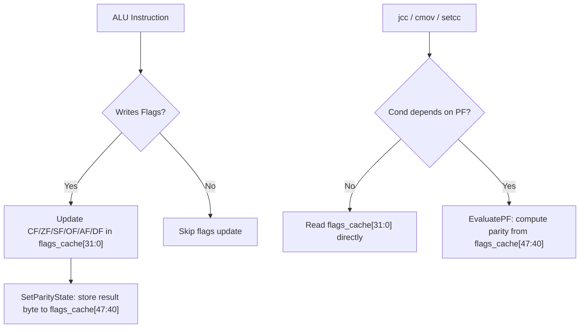

解释器执行期间传递的 `flags_cache` 是一个 `uint64_t`：

- 低 32 位：`architectural EFLAGS` 的实时映像（CF/ZF/SF/OF/AF/DF 等实时维护）
- 高位（40-47 位）：PF lazy state（存储的是 source byte，而非 PF bit 本身）

CF/ZF/SF/OF 几乎每个 ALU 指令都要写，而且 `jcc`/`cmov`/`setcc` 几乎每条都要读，做 lazy 的存取开销并不划算。但 PF 比普通 flags 更昂贵，且使用到 PF 的条件跳转仅有 `JP`/`JNP`（cond 10/11），比例很低，值得 lazy。

顺带一提，我试了好几种 PF 计算方法，ARM Neon的内置指令，直接位运算，还有查表。结论是查表最快，但是总归有访存延迟。Neon内置指令可能涉及跨SIMD寄存器的数据移动，没有查表快。

**静态层**：在基本块内做 flags 的 def-use 分析。如果某条指令写 flags，但后续无读取，就直接换成 no-flags Handler 变体。这种变体在 `AluAdd<T, false>`、`AluSub<T, false>` 等模板参数中体现，编译器会把整个 flags 更新路径完全消除。

**动态层**：每条指令执行时，`flags_cache` 作为寄存器参数在 tail-call 链中传递，永不写回内存。只有 `PF` 是 lazy 的：

- 写 PF 时，调用 `SetParityState(flags_cache, result_byte)`，将结果低 8 位直接放入高位 parity state，不计算 parity；
- 读 PF 时，调用 `EvaluatePF(flags_cache)`，从高位取出 source byte，现场算 parity；
- 外部可见点（`pushf`、`lahf`、fault、interrupt、API boundary）调用 `GetArchitecturalEflags()`，它会 materialize lazy parity 后再返回完整的 32 位 EFLAGS。

**Commit**：`CommitFlagsCache` 只在 handler chain 退出边界调用一次（`ExitOnCurrentEIP`、`ExitOnNextEIP`、restart/retry、resolver miss），把寄存器中的 `flags_cache` 写回 `state->ctx.flags_state`。成功 chaining 的情况下绝不 commit——因为下一条指令的 handler 还会以寄存器参数的形式继续传递同一个 `flags_cache`。`X86_Run()` 和 `X86_Step()` 在 handler 返回后也不再 commit，避免用过时的值覆盖已更新的状态。

对于 `CheckCondition` 的 LUT 路径：绝大多数条件跳转（cond 0-9, 12-15）不依赖 PF，所以它们走 `GetFlags32Raw(flags_cache)` 直接读取低 32 位，用 LUT 查表决定跳转方向；只有 cond 10/11（JP/JNP）会单独分支到 `EvaluatePF()`。这样设计让 PF lazy 的额外成本几乎为零。

### 3. 访存是瓶颈：MicroTLB 与 SoftTLB

项目早起的构想起于 LuaJIT Remake，第一次 profile 发现做CPU模拟器独有的问题是**地址转换**。

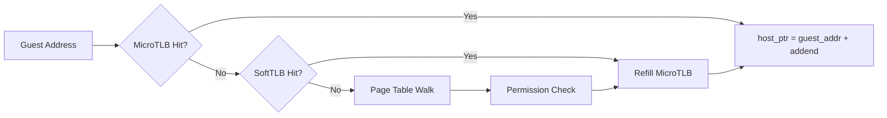

`SoftTLB` 是一个三路直接映射 TLB，三张固定大小的表：

| Field | Type | Offset | Size | 说明 |
| :--- | :--- | ---: | ---: | :--- |
| `read_tlb` | `std::array<TlbEntry, 256>` | 0 | 4096 | 读权限映射表 |
| `write_tlb` | `std::array<TlbEntry, 256>` | 4096 | 4096 | 写权限映射表 |
| `exec_tlb` | `std::array<TlbEntry, 256>` | 8192 | 4096 | 执行权限映射表 |

`TlbEntry` 对齐到 16 字节，固定 **16 字节**：

| Field    | Type              | Offset | Size | 说明                                    |
| :------- | :---------------- | -----: | ---: | :-------------------------------------- |
| `tag`    | `uint32_t`        |      0 |    4 | guest page 的 tag（高 20 位）           |
| `perm`   | `Property` (enum) |      4 |    4 | 权限位（Read / Write / Exec / Dirty …） |
| `addend` | `std::uintptr_t`  |      8 |    8 | `host_ptr = guest_addr + addend`        |

通过以下位运算直接索引：

```text
idx = (guest_addr >> PAGE_SHIFT) & 255
tag = guest_addr & ~PAGE_MASK
host_ptr = guest_addr + addend
```

`SoftTLB` 的职责是将已经查过的 guest page 映射压缩为一个 `tag + addend` 的快速表项。命中时，只要检查 tag，再做一次加法就能拿到宿主地址；miss 时，才回到慢路径检查权限、补表项、处理异常。

早期出了一个很低级的 TLB refill 错误，导致性能低下，`CoreMark` 只有 `400`。往 dispatch 方向查了一会没发现，修掉 TLB Bug后提升到 `800`。

这让我意识到地址转换路径也挺重要。

于是我往这个方向做了进一步设计：

- 在执行链路中携带 `MicroTLB` 常驻寄存器
- 命中后做 tag match + addend 加法
- 调整热字段布局，尽量让编译器更容易生成成对加载
- 在少数关键路径上强制将相关字段成组提前加载

`MicroTLB` 常驻寄存器，对齐到 16 字节，固定 **16 字节**：

| Field    | Type             | Offset | Size | 说明                                      |
| :------- | :--------------- | -----: | ---: | :---------------------------------------- |
| `tag_r`  | `uint32_t`       |      0 |    4 | 读权限 tag，默认 `0xFFFFFFFF`（未命中态） |
| `tag_w`  | `uint32_t`       |      4 |    4 | 写权限 tag，默认 `0xFFFFFFFF`（未命中态） |
| `addend` | `std::uintptr_t` |      8 |    8 | `host_ptr = guest_addr + addend`          |

read_tag + write_tag 合并在同一个寄存器，所以这个结构占两个 Host 寄存器。

它的 hit / miss 路径可以用下图表示：

```text
guest address
  -> check read_tag / write_tag
  -> hit: host_ptr = guest_addr + host_guest_addend
  -> miss: full translation + permission check + refill MicroTLB
```

refill 的时候要检查权限，如果没有 read 权限，清除 read_tag，反之亦然。

这个设计可能有点奇怪，如果读写反复不在同一个页面上，MicroTLB 会 Ping-pong，命中率为0。

但大多数时候有效，我测下来命中率高于50%，实际上只要有一定的命中，能降低从内存的 SoftTLB 读的频率，就有性能提升。

### 4. Block Linking 与 Superopcode

在这个解释器里，`BasicBlock` 是内存里的定长头部 + 变长指令流对象。它的头部大致长这样：

`BasicBlock` 对齐到 16 字节，头部固定 **48 字节**，后跟变长的 `DecodedOp` 数组：

| Field                 | Type                       | Offset |                              Size | 说明                                                   |
| :-------------------- | :------------------------- | -----: | --------------------------------: | :----------------------------------------------------- |
| `chain.start_eip`     | `uint64_t` (位域: 32 bits) |      0 | 4（嵌入 `BasicBlockChainPrefix`） | 块起始 guest PC                                        |
| `chain.inst_count`    | `uint64_t` (位域: 8 bits)  |      4 |                                 1 | 块内指令数                                             |
| `chain.valid`         | `uint64_t` (位域: 1 bit)   |      5 |                             1 bit | 块是否有效（用于失效标记）                             |
| `entry`               | `HandlerFunc*`             |      8 |                                 8 | 块首条指令的语义入口，解释器直接跳转到这里             |
| `end_eip`             | `uint32_t`                 |     16 |                                 4 | 块结束地址（最后一条指令的 next_eip）                  |
| `slot_count`          | `uint32_t`                 |     20 |                                 4 | 总 slot 数（含末尾 sentinel）                          |
| `sentinel_slot_index` | `uint32_t`                 |     24 |                                 4 | sentinel 在 slots 中的索引                             |
| `branch_target_eip`   | `uint32_t`                 |     28 |                                 4 | 分支目标地址（条件跳转/直接跳转时有效）                |
| `fallthrough_eip`     | `uint32_t`                 |     32 |                                 4 | fallthrough 地址                                       |
| `terminal_kind_raw`   | `uint8_t`                  |     36 |                                 1 | 终止类型（None / DirectJmpRel / DirectJccRel / Other） |
| `block_padding0`      | `uint8_t`                  |     37 |                                 1 | 填充                                                   |
| `block_padding1`      | `uint16_t`                 |     38 |                                 2 | 填充                                                   |
| `exec_count`          | `uint64_t`                 |     40 |                                 8 | 块被执行的次数（用于 profile-guided superopcode）      |
| `slots[]`             | `DecodedOp[]`              |     48 |              变长（每个 32 字节） | 预解码后的指令流                                       |

比较关键的字段：

- `entry` 指向这个块首条可执行语义入口，解释器拿到块之后可以直接从这里开始跑
- `slots[]` 是按顺序排好的 `DecodedOp` 数组，每个 `DecodedOp` 固定 `32` 字节
- `slot_count` 包含末尾 sentinel，所以块的内存布局是固定头部加一段连续的 op stream
- `branch_target_eip` / `fallthrough_eip` 让 block linking 可以在块级别预先知道后继去向
- `exec_count` 则是 profile-guided superopcode 的重要输入

`DecodedOp` 自己也不是“只有 handler 指针”的极简结构。它除了 `handler` 和 `next_eip` 之外，还会在扩展区里保存内存操作数信息、控制流目标，或者 block linking 之后缓存下来的 `next_block` 指针。

所以 `BasicBlock` 真正做的事情，其实是将三件事整合在一起：

1. 缓存预解码结果，避免重复 decode
2. 将一串 `DecodedOp` 紧凑地排列成可 tail-call 的执行流
3. 给 block linking / superopcode / profile 这些后续优化提供稳定载体

后续在做 block linking 时，直接在现有 `BasicBlock` 上进行拼接和复用。

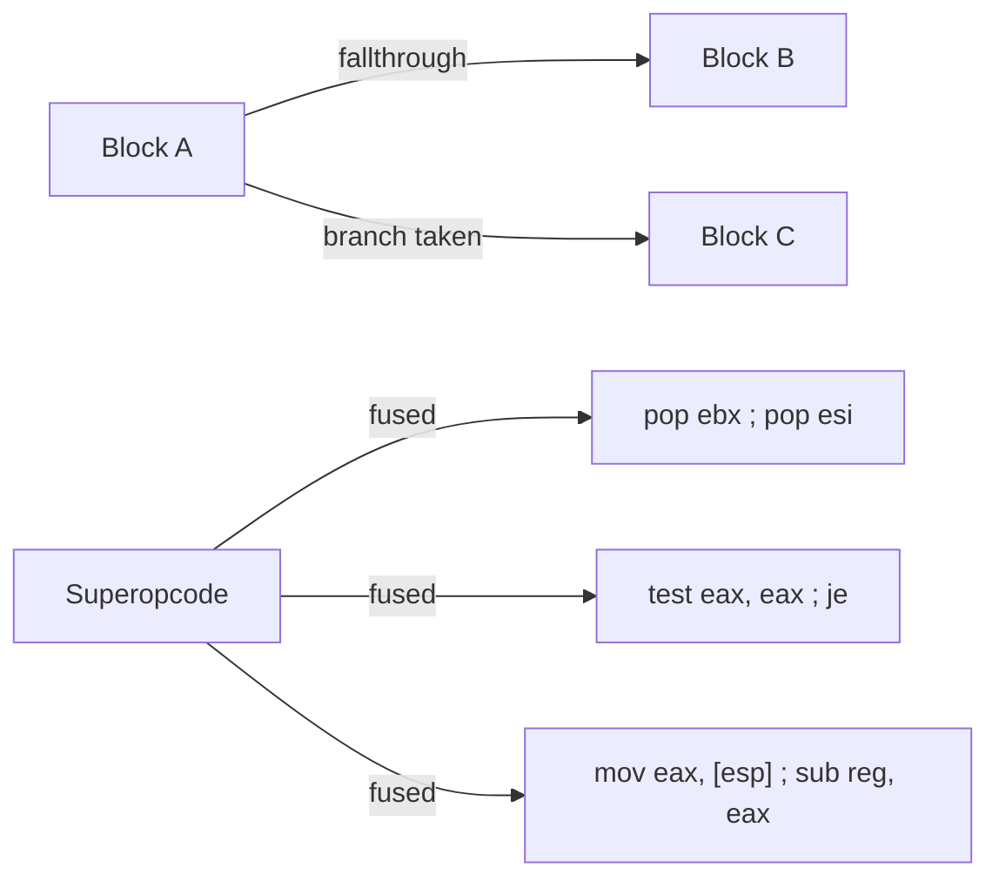

**Block Linking**：如果一个基本块足够短、指令不跨页，而且控制流关系简单，就将后继块中的指令直接拼接到当前块尾部，减少块间跳转时的间接访存。

**Superopcode**：围绕高频 anchor instruction 选取种子，再看它与前后指令的 def-use 关系，仅融合存在 `RAW` 依赖的组合。这一策略最终生成了约 256 个 superopcode。

代表性 superopcode：

- 栈操作链：`pop ebx ; pop esi`
- flags 生产者/消费者链：`test eax, eax ; je/jz ...`
- load-use 链：`mov eax, [esp+off] ; sub reg, eax`
- load-store 链：`mov ebx, [esp+off] ; mov [esi], ebx`

候选发现流程很简单，可以看 `Podish.PerfTool` 工程：

```text
block trace
  -> 热点统计
  -> anchor 选择
  -> def-use / RAW 过滤
  -> 代码生成
  -> 回归验证与收益复核
```

---

## 内存管理机制: Page Cache管理，在支持的平台直接映射文件

Podish 运行时的内存模型被拆成两层：`AddressSpace` / `AnonVma` 负责保存 resident page 的语义内容，`ProcessPageManager` 只负责记录哪些 guest page 目前被安装进原生 MMU；中间的 `HostPageManager` 则按“每个 live host 指针一条元数据”的方式维护状态。因此 guest→host 的原生映射可以随时拆掉再重建，而不会丢失底层页面本身的内容和所有权。

在原生平台上，file-backed page 会尽量走 **直接映射 Host File Page** 路径。`MappingBackedInode.AcquireMappingPage(...)` 通过操作系统API获取一个映射的虚拟内存窗口，随后 `EnsureExternalMapping(...)` 直接把这个 host pointer 安装进 guest 的 SoftMMU，热路径只做地址转换（`guest_addr + addend`）和权限检查。相关类在 `MappedFilePageCache`：如果平台支持文件映射，它会选择 `WindowedMappedFilePageBackend`，按宿主的页面大小建立映射窗口、复用活跃窗口，并用 lease token 管理窗口生命周期，确保映射移动或引用释放时能安全释放资源。

到了 Browser/Wasm，这条直接映射路径会被关闭（平台也不支持）。`HostMemoryMapGeometry.CreateCurrent()` 会把 mapped-file backend 标成 unsupported，于是 `FilePageBackendSelector` 自动回退到 `BufferedPageBackend`。这时运行时不再依赖操作系统提供的文件映射窗口，而是把文件内容拷贝到自己管理的内部 `PageCache` 页面里，后续 fault / install 再把这些页面当作普通 resident host page 来处理。这样做比原生平台多一次拷贝，也无法做 mapped-file flush 的快路径，不过 fault / COW / reclaim 这些后续管线几乎不用改，同一套架构在 Wasm 平台上能够轻松跑起来。

---

## SMC（自修改代码）处理

SMC（Self-Modifying Code）是现代 JIT 引擎（V8、LuaJIT、.NET JIT）所必需的：它们先写机器码到内存，再跳转过去执行。模拟器必须正确处理。

这里为了效率**复用了 MMU 的权限系机制**，将检测成本压进权限位：

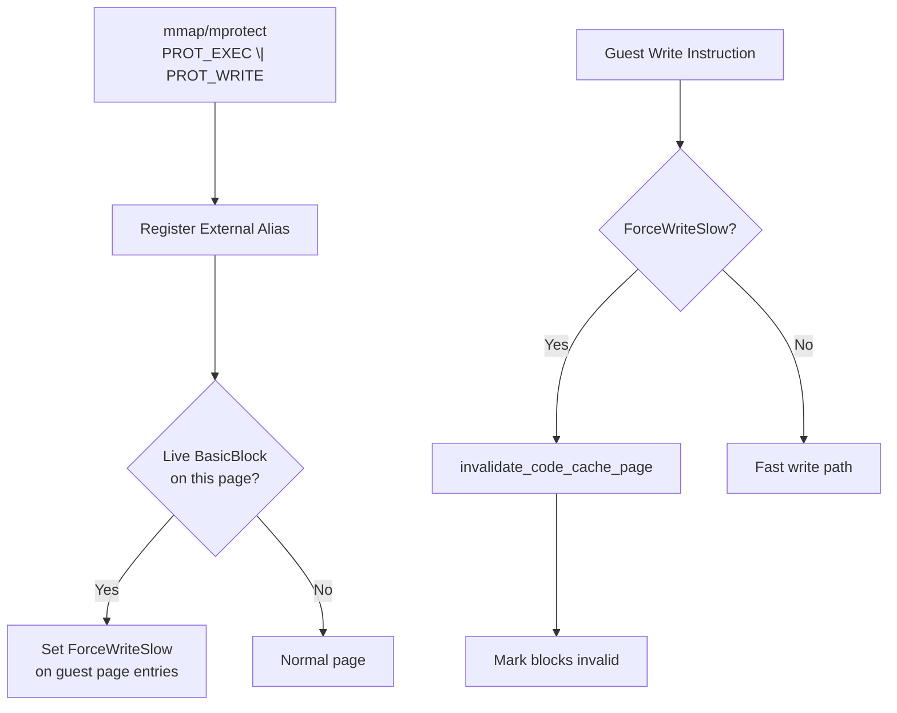

当某个 host page 同时被映射为**可执行**和**可写**时，MMU 会把它标记为 `External Alias`。如果该页上已缓存了 `BasicBlock`，MMU 会给对应 guest page 表项打上 `ForceWriteSlow`。后续任何对该页的写操作，在 TLB refill 时会命中 `ForceWriteSlow`，走慢路径调用 `invalidate_code_cache_page`，将该页关联的所有 `BasicBlock` 标记为失效。

**执行期竞争**：仅靠"写的时候失效 block cache"还不够。如果当前 EIP 正好落在被写的页上，解释器 tail-call 跳转到的下一条指令可能已经被改写。为此实现了 `ShouldInterceptExecWriteForSmc`：一旦检测到当前 EIP 所在页被修改，会立即 yield 并切换到**单指令安全模式**（`max_insts = 1`），确保“写操作”与“跳转到新代码”之间有一个明确的指令边界，避免竞争。

**多 Engine TLB 一致性**：`clone(CLONE_VM)` 创建的新线程共享同一个 `MmuCore`，但每个 `Engine` 有自己的 `SoftTLB`。为此实现了 `RuntimeTlbShootdownRing`（1024 槽 ring buffer），页表变更方把被 flush 的 guest page 写入 ring，其他 Engine 在下次进入 `X86_Run` 时同步消费。

这套机制足够让 LuaJIT 稳定运行了，Node.js / V8 能启动。但偶发 crash，可能与指令集实现或 syscall 不完整有关。

---

## 对 Copy-and-Patch JIT 的尝试

Copy-and-patch 的核心思路：先将 Opcode handler 预编译成 binary stencil，运行时仅做"拷贝模板 + patch 常量/地址/跳转槽位"。理论上可以避开完整后端、寄存器分配和传统机器码生成器的复杂度（相关论文：[Copy-and-Patch Compilation](https://arxiv.org/abs/2011.13127)）。

由于我已经用 `preserve_none` + `[[musttail]]` 将解释器热路径压得很低，我尝试将 handler 变成 stencil 再 patch 参数，连接成机器码。预期 200%+ 的性能提升，**实际上比解释器还略慢**。

原因：direct-threaded interpreter 已经把 dispatch 压得很低了，瓶颈变成了访存、地址转换、状态维护和 I-Cache 压力。stencil 虽然省掉了一些字节码读取，但 patch 后代码膨胀，I-Cache 压力反而更大。

这个失败很有价值：我认为这说明**劣质 JIT 还不如好的解释器**，于是我继续 profile 访存路径。

---

## 多线程模型

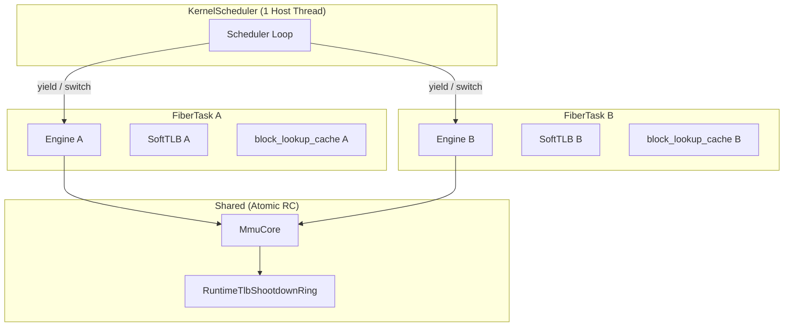

我实现了 `clone`/`fork`/`vfork` 和基本的 `pthread` 语义，但实际上：

- `KernelScheduler` 绑定到一个固定的宿主线程。所有 `FiberTask` 的创建、切换、syscall 分发和信号递送，都在这个线程上顺序执行。
- 每个 `FiberTask` 拥有独立的 `Engine` 实例，解释器核心**不需要**线程安全设计。
- `clone(CLONE_VM | CLONE_THREAD)` 创建的新线程共享同一个 `MmuCore`（原子引用计数管理生命周期）。
- 多个 Engine 共享 `MmuCore` 带来的 TLB 一致性问题，通过 `RuntimeTlbShootdownRing` 解决。

上限：guest 的多个线程在宿主层面是**串行调度**的，不能利用多核并行。对于 shell、Python、小型编译任务来说还好；大项目编译，并行计算会受到明显限制。

---

## Linux 兼容层与可用性

Linux 兼容层实现了：

- 类 Linux 的 `fork` / `vfork` / `clone` / `execve` / `wait*` 语义
- `tmpfs` / `procfs` / host mounts / overlay roots
- PTY / TTY
- sockets 和原生 netstack 集成
- OCI image pull/save/load/import/export
- 以 `Podish.Cli` 为入口的 container-style execution

下面这个表列了一些我测试过的程序。

| 类别 | 代表程序 / 证据 | 当前状态 | 备注 |
| :--- | :--- | :--- | :--- |
| shell | `/bin/sh -lc true` | 已验证 | 目前正文主要覆盖 shell 启动和短命令 |
| coreutils / archive | `grep -R` / `tar cf` / `tar xf` | 已验证 | |
| scripting | `python` (`primes.py`) | 已验证 | workload 当前只有少量样本，容易受手机上温度影响 |
| JIT-heavy | `LuaJIT` (`primes_jit.lua`) | 已验证 |  |
| build-oriented mixed workload | `make compile` on CoreMark tree | 已验证 | |
| network / tooling compat | `git clone` | 已验证兼容 |  |

---

## 图形与音频的实验性支持

代码库里已有两条实验性的多媒体管线，但还未成熟到进入日常测试：

- **`Podish.Wayland`**：轻量 Wayland 合成器，能把 guest 的 Wayland 客户端协议桥接到宿主 SDL 窗口。图形路径目前只支持通过 shmem 发送 Wayland Surface，不支持 gbm/EGL。`foot` 能跑通，但 SDL2 还不行（我调查了下，它在Wayland下似乎强依赖EGL）。
- **`Podish.Pulse`**：PulseAudio 协议栈的客户端/服务器端，能把 guest 音频流重定向到宿主音频后端。`ffplay -nodisp` 能播放音乐。

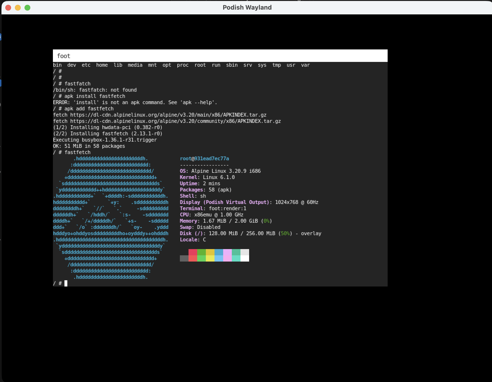

这两个功能目前只在 macOS 上支持，iOS / Wasm 还没做适配。

---

## 性能数据与优化历程记录

### 从 600 到 3000

| 阶段 | 关键变化 | CoreMark | 备注 |
| :--- | :--- | ---: | :--- |
| 初始版本 | baseline interpreter | ~400 |  TLB bug  |
| 修 TLB bug | fix address translation path | ~800 | 修复了 TLB Bug |
| 热路径优化 | PC / block budget / template specialization | ~1500 | 不再每条指令都更新 eip 等内存变量 |
| 访存整理 | data layout / paired loads | ~2000 | 优化重点从 dispatch 转向访存组织 |
| lazy flags | static prune + PF lazy | ~2200 | 实现目前的 lazy flags 方案 |
| block linking | append simple successor block | ~2500 | 降低块边界开销 |
| superopcode | profile-guided fused ops | ~3000 | 约 256 个 superopcode |

### 目前的基准测试数据

**测试环境**：

- Podish / QEMU 桌面数据：`MacBook Pro (Apple M3 Max, macOS 26.3)`
- iSH 数据：`iPhone 17` 标准版（`A19`），`Alpine Linux v3.14.3`
- Podish / QEMU Guest：`docker.io/i386/alpine:3.23`
- Native host 参考：同一台 `MacBook Pro (Apple M3 Max, macOS 26.3)`

**启动速度与计算密集任务**：

| Workload | Podish(A19) | Podish(M3 Max) | iSH (A19) | Podman i386 (QEMU JIT) | QEMU TCI | Native host (M3 Max) | 测试说明 |
| :--- | ---: | ---: | ---: | ---: | ---: | ---: | :--- |
| `sh -lc true` warm start | 20 ms | 20 ms | 30 ms | 30 ms | 30 ms | 10 ms | 启动成本；Podish 用 `Podish.Cli run`；QEMU 显式 `qemu-i386 -L <rootfs>` |
| CoreMark 1.0 | 3447 | 2967 | 1692 | 11456 | 325 | 38087 | |
| `python primes.py` | 78.3 s | 89.4 s | 684.4 s | 40.9 s | 787.3 s | 1.8 s | 测试用例来自 [kostya/benchmarks](https://github.com/kostya/benchmarks) |
| `luajit primes` | 3.1 s | 4.0 s | 46.6 s | 1.7 s | 39.3 s | 0.2 s | |
| `luajit -joff` | 14.5 s | 17.3 s | 27.5 s | 7.1 s | 152.7 s | 0.7 s | |

**文件 IO 和混合任务**：

| Workload | Podish(A19) | Podish(M3 Max) | iSH (A19) | Podman i386 (QEMU JIT) | Native host (M3 Max, arm64) | 备注 |
| :--- | ---: | ---: | ---: | ---: | ---: | :--- |
| `grep -R` on CoreMark tree | 50 ms | 50 ms | 70 ms | 70 ms | 10 ms | 排除 `.git`, GNU grep |
| `tar cf` CoreMark tree | 40 ms | 30 ms | 40 ms | 97 ms | 10 ms | GNU tar |
| `tar xf` CoreMark tree | 250 ms | 250 ms | 170 ms | 161 ms | 30 ms | GNU tar |
| `make compile` on CoreMark tree | 9470 ms | 10460 ms | 11430 ms | 7330 ms | 210 ms | `make compile`；native 为单进程 `make -j1 compile CC=clang` |
| `git clone` CoreMark | 3230 ms | 3300 ms | 5190 ms | 2660 ms | 2980 ms | 说明能跑，受网络影响时间没什么意义 |

以上两张表，除有明确说明的以外，均为 5 次实验的中位数。QEMU TCI 模式在文件 IO 测试中暂缺（太慢，意义不大）。

### iSH的奇怪现象

**iSH 上 `luajit -joff` 比开启 JIT 还快**

在 iSH 上，`luajit -joff` 跑 `primes_jit.lua` 耗时 27530 ms，而开启 JIT 的要 46650 ms。推测原因：

- iSH 对 SMC 的处理路径非常重，LuaJIT 开启 JIT 后频繁生成和修补机器码，导致代码缓存频繁失效、flush、重翻译
- `-joff` 模式下 LuaJIT 退化成纯 bytecode 解释器，不再生成机器码，也就不会触发 SMC 陷阱
- 另一个可能是 iSH 的 TLB / 页表 walk 在写保护页上存在额外开销

> 我对 iSH 内部实现没有深入研究过，以上只是猜测。如果你熟悉 iSH 的源码，非常欢迎在评论区分享。

### 与 Wasm3 的对比

作为另一个纯解释器的参考，我在同一台 MacBook 上用 `wasm3 coremark.wasm` 跑了 5 次：

- 第 1 次：`Iterations = 60000`，`CoreMark = 3308`
- 后 4 次：`Iterations = 40000`，中位数约为 `3229`

也就是说，Podish 的纯计算性能已经可以比肩 Wasm3 了。

--

如果你对项目感兴趣，欢迎访问 [GitHub](https://github.com/meokit/podish) 或在浏览器里直接体验 [Podish Web Demo](https://podish.meokit.com)。
