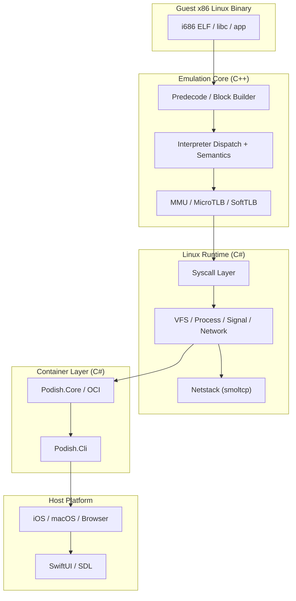
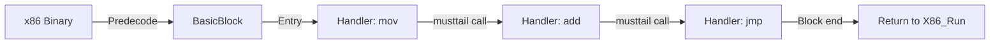
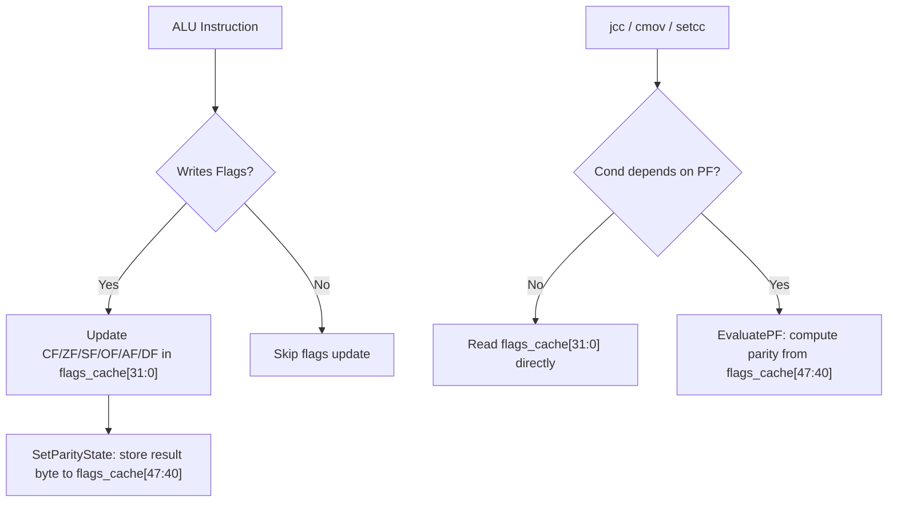
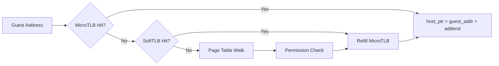
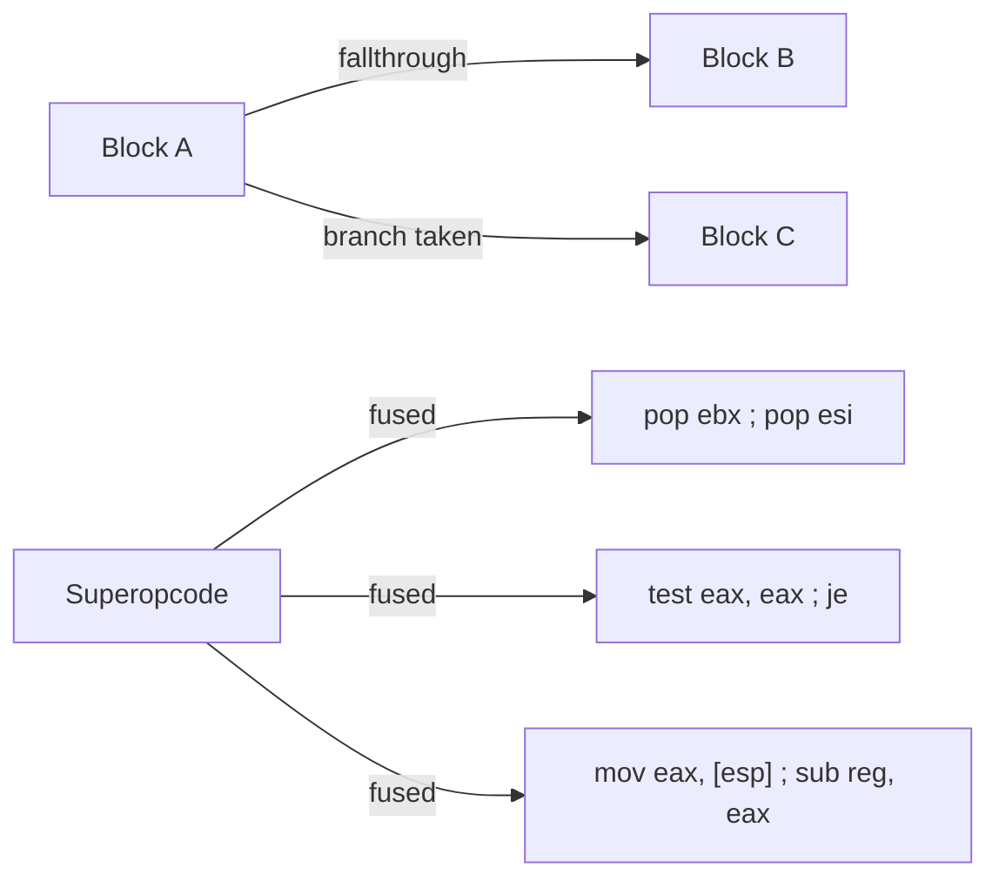
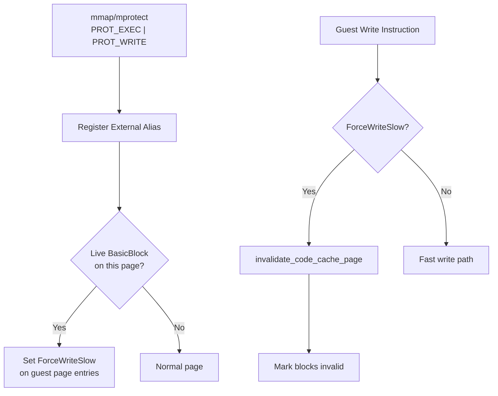
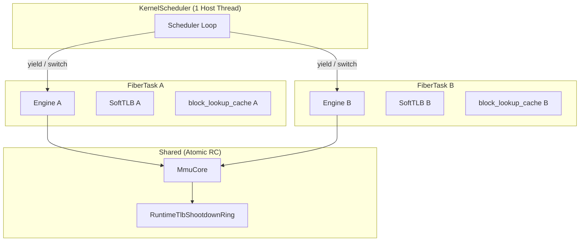

[中文版 (Chinese Version)](/posts/podish-technique-report-zh)


# An iOS-optimized Linux x86 container (faster than iSH)

> **TL;DR**: `Podish` is a high-performance Linux x86 user-space container optimized specifically for iOS and Apple Silicon. I wrote an i686 interpreter core in C++ and a Linux compatibility layer in C#. On an iPhone 17 (A19), it scores ~3400 on CoreMark, which is about twice as fast as iSH.
>
> Web Demo: [https://podish.meokit.com](https://podish.meokit.com)
>
> GitHub: [https://github.com/meokit/podish](https://github.com/meokit/podish)

---

## Project Overview

Podish's goal: run x86 Linux programs as efficiently as possible on **JIT-restricted iOS**. Similar to iSH, but written completely from scratch, and roughly twice as fast across multiple dimensions.

### What It Can Run

| Category              | Representative Program     | Status                                     |
| :-------------------- | :------------------------- | :----------------------------------------- |
| Shell / Base Userland | `busybox` / `bash` / `vim` | Stable                                     |
| Scripting Runtime     | `python3` / `LuaJIT`       | Verified; stable benchmarks                |
| Build Toolchain       | `gcc` / `make`             | Verified; `make compile` works             |
| Network / Dev Tools   | `git` / `OpenSSH`          | Manually verified; `git clone` works       |
| Heavy Runtime         | `Node.js` / `Gemini CLI`   | Boots; occasional crashes (V8 JIT related) |

### Screenshots

**Terminal environment on iPhone**:


**Browser Demo** (no installation needed):


**CoreMark on iPhone**:


**Running Gemini CLI**:


### Performance at a Glance

| Workload                 | Podish (A19) | iSH (A19) |   Speedup |
| :----------------------- | -----------: | --------: | --------: |
| CoreMark 1.0             |     **3447** |      1692 | **~2.0×** |
| `python primes.py`       |       78.3 s |   684.4 s | **~8.7×** |
| `luajit -joff primes`    |       14.5 s |    27.5 s | **~1.9×** |
| `sh -lc true` warm start |        20 ms |     30 ms | **~1.5×** |

_Full benchmarks and testing environment details are at the end in "[Performance Data & Optimization Journey](#performance-data--optimization-journey)"._

---

> **The following sections dive into technical implementation details.** If you only want to know the project's current state, the overview above is sufficient. The rest is dry technical detail.

---

## Motivation & Background

iOS has a restriction: no JIT compilation. Specifically, the system prohibits WX (Write-XOR-Execute) memory page mappings; unsigned code cannot execute. This means you cannot download a JIT-accelerated UTM from the App Store — only the painfully slow UTM SE. You also cannot run LuaJIT in JIT mode.

Against this background, I wanted to know: **Just how fast can an interpreter get?** Can a carefully designed, hardware-aware interpreter rival JIT performance without using JIT at all?

The main inspiration for the interpreter was [LuaJIT Remake](https://github.com/luajit-remake/luajit-remake). Through it, I learned about Clang's `preserve_none`, `preserve_all`, and `[[musttail]]` ABI features — tools that could let the compiler generate interpreter hot paths comparable to hand-written assembly.

The project started with `hello world` (week one), got `CoreMark` running (about a month later), and now stably runs Busybox, Bash, Python, LuaJIT, GCC, and even starts Node.js and Gemini CLI.

---

## Overall Architecture

Podish is not a monolithic design; it has clear layers:



The repository has these layers:

- `libfibercpu`: IA-32 emulator core written in C++
- `Fiberish.Core`: Linux runtime / kernel compatibility layer
- `Fiberish.Netstack`: Based on [smoltcp](https://github.com/smoltcp-rs/smoltcp)
- `Podish.Core`: Higher-level container/runtime orchestration
- `Podish.Cli`: CLI for actual usage
- SwiftUI / Browser interfaces

### Why I wrote the syscall layer in C#

**Why C#?** I needed to rapidly implement the semantics for about 200 Linux syscalls, a VFS layer, a network stack, and container lifecycle management. C#'s cross-platform I/O, string handling, async model, and rich standard library let me get a shell running in a month. If I had used pure C++, I'd have had to directly interface with a lot of different system APIs.

**Controlling cross-language overhead:** To prevent P/Invoke from becoming a bottleneck and to simplify lifecycle management, I designed it like this:

- **Use a C API**: `libfibercpu` exposes a strictly C-style API (`X86_Create`, `X86_Run`, `X86_RegRead`, etc.), which C# calls via `LibraryImport` / `DllImport`. The `EmuState` is just an `IntPtr` on the C# side, creating zero GC pressure.
- **Zero-copy memory access**: The C# layer never reads/writes guest memory byte-by-byte through P/Invoke. `bindings.h` provides interfaces that return raw host pointers, which C# maps using `Span<byte>` or `MemoryMarshal` to manipulate directly.
- **Pin callbacks with GCHandle**: Callbacks into C# (Fault, Interrupt, Log) need to hold a reference to the C# `Engine` object. I pin the object on the heap using `GCHandle.Alloc(this)` and pass the pointer to C++ as `userdata`, completely avoiding GC relocation issues across the boundary.
- **Only syscalls enter C#**: In the hot path, the guest program usually executes hundreds or thousands of instructions in C++ before triggering a single syscall. The actual frequency of boundary crossings depends on the guest's syscall density, not its instruction density.

Profiling shows that in compute-heavy workloads (like CoreMark), language boundary overhead accounts for less than 1%. In I/O-heavy workloads (like `git clone`), the bottlenecks are the network and VFS, not P/Invoke.

---

## Interpreter Design

The core goal of the interpreter is: **push the overhead of x86 emulation as low as possible without using JIT.** Here are a few key design choices.

### 1. Pre-decoding + Tail-call Dispatch

Traditional interpreters usually have a central dispatch loop (`while (1) { decode; dispatch; execute; }`), returning to the loop after every instruction. I chose to simplify dispatch as much as possible, chaining instructions with tail calls:



Specifically:

1. **Pre-decode**: Variable-length x86 instructions are decoded into a fixed-length Intermediate Representation (`DecodedOp`, 32 bytes), stored sequentially in a Basic Block.
2. **Tail-call chain**: Each IR carries its own handler function pointer. After executing the current instruction, instead of returning to a central dispatcher, it directly tail-calls into the next instruction's handler via `[[musttail]]`.
3. **Caching**: Decoded results are cached in `BasicBlock`, avoiding repeated decode.

A big shoutout to Justine Tunney's [blink](https://github.com/jart/blink) project, which introduced me to Intel's [XED](https://github.com/intelxed/xed) and helped me build the table-driven decoder.

`DecodedOp` is fixed at **32 bytes**, aligned to a 16-byte boundary:

| Field                 | Type                              | Offset | Size | Description                                        |
| :-------------------- | :-------------------------------- | -----: | ---: | :------------------------------------------------- |
| `handler`             | `HandlerFunc*` (function pointer) |      0 |    8 | Entry point for the instruction's semantics        |
| `next_eip`            | `uint32_t`                        |      8 |    4 | PC of the next instruction                         |
| `len`                 | `uint8_t`                         |     12 |    1 | Instruction byte length                            |
| `modrm`               | `uint8_t`                         |     13 |    1 | ModRM byte                                         |
| `prefixes`            | `Prefixes` (union with bitfields) |     14 |    1 | Prefix info (lock/rep/segment…)                    |
| `meta`                | `Meta` (union with bitfields)     |     15 |    1 | Meta info (has_mem / has_imm / ext_kind…)          |
| `ext.data`            | `DecodedMemData`                  |     16 |   16 | Memory operand description (imm / ea_desc / disp)  |
| `ext.link.next_block` | `BasicBlock*`                     |     24 |    8 | Cached successor block pointer after block linking |
| `ext.control`         | `DecodedControlFlowData`          |     16 |   16 | Control-flow target (target_eip / cached_target)   |

If we take a simple memory ALU instruction as an example:

```text
Guest:
  add eax, [ebx+4]

Predecoded IR:
  entry      = op_add_r32_rm32
  next_pc    = 0x...
  operands   = { dst=eax, src=mem(base=ebx, disp=4, size=4) }
  flags_mode = arithmetic
  control    = fallthrough
```

### 2. Parity-Only Lazy Flags

x86 `EFLAGS` is tricky to handle. QEMU uses a very elegant [lazy evaluation system](https://qemu.weilnetz.de/w64/2012/2012-12-04/qemu-tech.html) where they store `CC_SRC`, `CC_DST`, and `CC_OP`, only calculating the flags when explicitly requested.

I tried it and found it was slower in my case — because writing those three variables to memory and reading them back was killing me. I was already memory-bound.

I ended up choosing to **only evaluate the Parity Flag (PF) lazily.**



During execution, `flags_cache` is a `uint64_t` passed through the tail-call chain:

- Lower 32 bits: real-time architectural EFLAGS (CF/ZF/SF/OF/AF/DF maintained in real time)
- Upper bits (bits 40-47): PF lazy state (stores the source byte, not the PF bit itself)

CF/ZF/SF/OF are written by almost every ALU instruction and read by almost every `jcc`/`cmov`/`setcc`. Doing them lazily adds memory overhead that isn't worth it. But PF is more expensive than ordinary flags, and it is rarely used (only by `JP`/`JNP`, cond 10/11), so it's worth lazying.

I also tried several ways to compute PF — ARM Neon built-in instructions, direct bit operations, and table lookup. Table lookup was fastest, but still has memory access latency. Neon built-in instructions may involve data movement across SIMD registers, so they were not faster than table lookup.

**Static layer:** Within a basic block, I do def-use analysis on flags. If an instruction writes flags but no one reads them later, it is replaced directly with a no-flags handler variant. This variant is expressed through template parameters like `AluAdd<T, false>` and `AluSub<T, false>`; the compiler completely removes the entire flags-update path.

**Dynamic layer:** During execution of each instruction, `flags_cache` is passed as a register argument through the tail-call chain and is never written back to memory. Only `PF` is lazy:

- When writing PF, `SetParityState(flags_cache, result_byte)` stuffs the low 8 bits of the result directly into the high parity state bits without calculating parity;
- When reading PF, `EvaluatePF(flags_cache)` retrieves the source byte from the high bits and calculates parity on the spot;
- At externally visible points (`pushf`, `lahf`, faults, interrupts, API boundaries), `GetArchitecturalEflags()` materializes the lazy parity and returns the full 32-bit EFLAGS.

**Commit:** `CommitFlagsCache` is only called once at handler chain exit boundaries (`ExitOnCurrentEIP`, `ExitOnNextEIP`, restart/retry, resolver miss), writing the register-held `flags_cache` back to `state->ctx.flags_state`. During successful chaining it is never committed — because the next instruction's handler will continue passing the same `flags_cache` as a register argument. `X86_Run()` and `X86_Step()` also do not commit after the handler returns, to avoid overwriting updated state with a stale caller-side copy.

For the `CheckCondition` LUT path: the vast majority of conditional jumps (cond 0-9, 12-15) do not depend on PF, so they read the low 32 bits via `GetFlags32Raw(flags_cache)` and use a LUT lookup to decide the branch direction; only cond 10/11 (JP/JNP) branch separately to `EvaluatePF()`. This design makes the extra cost of PF laziness nearly zero.

### 3. Memory Access is the Real Bottleneck: MicroTLB and SoftTLB

The idea started with LuaJIT Remake. My first profile showed that address translation is a unique problem for CPU emulators.



`SoftTLB` is a three-way direct-mapped TLB consisting of three fixed-size tables:

| Field       | Type                        | Offset | Size | Description                    |
| :---------- | :-------------------------- | -----: | ---: | :----------------------------- |
| `read_tlb`  | `std::array<TlbEntry, 256>` |      0 | 4096 | Read-permission mapping table  |
| `write_tlb` | `std::array<TlbEntry, 256>` |   4096 | 4096 | Write-permission mapping table |
| `exec_tlb`  | `std::array<TlbEntry, 256>` |   8192 | 4096 | Execute-permission mapping table |

`TlbEntry` is aligned to 16 bytes, fixed at **16 bytes**:

| Field    | Type              | Offset | Size | Description                                     |
| :------- | :---------------- | -----: | ---: | :---------------------------------------------- |
| `tag`    | `uint32_t`        |      0 |    4 | Guest page tag (high 20 bits)                   |
| `perm`   | `Property` (enum) |      4 |    4 | Permission bits (Read / Write / Exec / Dirty …) |
| `addend` | `std::uintptr_t`  |      8 |    8 | `host_ptr = guest_addr + addend`                |

Index directly with these bit operations:

```text
idx = (guest_addr >> PAGE_SHIFT) & 255
tag = guest_addr & ~PAGE_MASK
host_ptr = guest_addr + addend
```

`SoftTLB`'s job is to compress already-looked-up guest page mappings into a fast `tag + addend` entry. On a hit, you just check the tag and do one addition to get the host address; on a miss, you fall back to the slow path to check permissions, fill the entry, and handle exceptions.

Early on there was a very silly TLB refill bug that hurt performance; CoreMark was only ~400. I looked at dispatch for a while and found nothing. After fixing the TLB bug it jumped to ~800. This made me realize address translation matters too.

I added a `MicroTLB` — a 16-byte structure kept in a host register during the execution chain. If it hits, it's just a quick tag match and an addition (`host_ptr = guest_addr + addend`).

`MicroTLB` is a resident register structure, aligned to 16 bytes, fixed at **16 bytes**:

| Field    | Type             | Offset | Size | Description                                             |
| :------- | :--------------- | -----: | ---: | :------------------------------------------------------ |
| `tag_r`  | `uint32_t`       |      0 |    4 | Read-permission tag, default `0xFFFFFFFF` (miss state)  |
| `tag_w`  | `uint32_t`       |      4 |    4 | Write-permission tag, default `0xFFFFFFFF` (miss state) |
| `addend` | `std::uintptr_t` |      8 |    8 | `host_ptr = guest_addr + addend`                        |

`read_tag` + `write_tag` fit in the same register, so this structure occupies two host registers.

Its hit/miss path can be represented as:

```text
guest address
  -> check read_tag / write_tag
  -> hit: host_ptr = guest_addr + host_guest_addend
  -> miss: full translation + permission check + refill MicroTLB
```

During refill, permissions are checked; if there is no read permission, `read_tag` is cleared, and vice versa.

This design may seem odd — if reads and writes repeatedly hit different pages, the MicroTLB will ping-pong and the hit rate drops to zero.

But most of the time it works. My measurements show a hit rate above 50%. As long as there is some hit rate, reducing the frequency of reads from the in-memory SoftTLB provides a performance boost.

### 4. Block Linking and Superopcodes

In this interpreter, `BasicBlock` is an object with a fixed-size header followed by a variable-length instruction stream. Its header looks roughly like this:

`BasicBlock` is aligned to 16 bytes; the header is fixed at **48 bytes**, followed by a variable-length `DecodedOp` array:

| Field                 | Type                           | Offset |                                    Size | Description                                                                        |
| :-------------------- | :----------------------------- | -----: | --------------------------------------: | :--------------------------------------------------------------------------------- |
| `chain.start_eip`     | `uint64_t` (bitfield: 32 bits) |      0 | 4 (embedded in `BasicBlockChainPrefix`) | Block start guest PC                                                               |
| `chain.inst_count`    | `uint64_t` (bitfield: 8 bits)  |      4 |                                       1 | Number of instructions in the block                                                |
| `chain.valid`         | `uint64_t` (bitfield: 1 bit)   |      5 |                                   1 bit | Whether the block is valid (for invalidation marking)                              |
| `entry`               | `HandlerFunc*`                 |      8 |                                       8 | Semantic entry point of the first instruction; the interpreter jumps here directly |
| `end_eip`             | `uint32_t`                     |     16 |                                       4 | Block end address (next_eip of the last instruction)                               |
| `slot_count`          | `uint32_t`                     |     20 |                                       4 | Total slot count (including trailing sentinel)                                     |
| `sentinel_slot_index` | `uint32_t`                     |     24 |                                       4 | Index of the sentinel in the slots array                                           |
| `branch_target_eip`   | `uint32_t`                     |     28 |                                       4 | Branch target address (valid for conditional/direct jumps)                         |
| `fallthrough_eip`     | `uint32_t`                     |     32 |                                       4 | Fallthrough address                                                                |
| `terminal_kind_raw`   | `uint8_t`                      |     36 |                                       1 | Terminal kind (None / DirectJmpRel / DirectJccRel / Other)                         |
| `block_padding0`      | `uint8_t`                      |     37 |                                       1 | Padding                                                                            |
| `block_padding1`      | `uint16_t`                     |     38 |                                       2 | Padding                                                                            |
| `exec_count`          | `uint64_t`                     |     40 |                                       8 | Number of times the block has been executed (for profile-guided superopcode)       |
| `slots[]`             | `DecodedOp[]`                  |     48 |                Variable (32 bytes each) | Pre-decoded instruction stream                                                     |

A few especially critical fields:

- `entry` points to the first executable semantic entry of this block; once the interpreter has the block, it can start running from here directly.
- `slots[]` is a sequentially ordered `DecodedOp` array, each `DecodedOp` fixed at `32` bytes.
- `slot_count` includes the trailing sentinel, so the block's memory layout is a fixed header plus a contiguous op stream.
- `branch_target_eip` / `fallthrough_eip` let block linking know successor destinations at the block level ahead of time.
- `exec_count` is important input for profile-guided superopcode generation.

`DecodedOp` itself is not a minimal "handler-pointer-only" structure. Beyond `handler` and `next_eip`, it also stores memory operand info, control-flow targets, or the `next_block` pointer cached after block linking in its extension area.

So what `BasicBlock` really does is bind three things together:

- Caching pre-decode results to avoid repeated decoding
- Placing a sequence of `DecodedOp`s compactly into a tail-callable execution stream
- Providing a stable carrier for subsequent optimizations like block linking, superopcode, and profiling

When I later implemented block linking, I stitched and reused directly on top of the existing `BasicBlock`.



**Block Linking**: If a basic block is short enough, its instructions don't cross page boundaries, and its control flow is simple, the successor block's instructions are directly appended to the end of the current block. This reduces some indirect memory access during inter-block jumps.

**Superopcode**: Select seeds around high-frequency anchor instructions, then examine their def-use relationship with neighboring instructions. Only fuse combinations with `RAW` (Read-After-Write) dependencies. This strategy ultimately generated about `256` superopcodes.

Representative examples:

- Stack-operation chains: `pop ebx ; pop esi`
- Flags producer/consumer chains: `test eax, eax ; je/jz ...`
- Load-use chains: `mov eax, [esp+off] ; sub reg, eax`
- Load-store chains: `mov ebx, [esp+off] ; mov [esi], ebx`

The candidate discovery pipeline is simple; see the `Podish.PerfTool` project:

```text
block trace
  -> hotspot statistics
  -> anchor selection
  -> def-use / RAW filtering
  -> code generation
  -> regression verification and benefit review
```

---

## Memory Management: Page Cache Management, Direct File Mapping on Supported Platforms

At runtime, Podish's memory model is split into two layers: `AddressSpace` / `AnonVma` own the semantic contents of resident pages, while `ProcessPageManager` only mirrors which guest pages are currently installed into the native MMU. `HostPageManager` sits in the middle and keeps one metadata record per live host pointer, so native guest→host mappings can be torn down and rebuilt without losing the underlying page state.

On native platforms, file-backed pages try hard to stay as **direct-mapped Host File Pages**. `MappingBackedInode.AcquireMappingPage(...)` acquires a mapped virtual memory window via OS APIs, `EnsureExternalMapping(...)` then installs that host pointer directly into the guest's SoftMMU, and from there the hot path is just address translation (`guest_addr + addend`) plus permission checks. The relevant classes are in `MappedFilePageCache`, which selects `WindowedMappedFilePageBackend` when the platform supports file mapping: it maps windows aligned to host page size, reuses active windows, and tracks lease tokens so those windows can be released safely when mappings move or references drop.

On Browser/Wasm, that direct-mapping path is disabled (the platform doesn't support it either). `HostMemoryMapGeometry.CreateCurrent()` marks mapped-file backends unsupported, so `FilePageBackendSelector` falls back to `BufferedPageBackend`. In that mode there is no OS-backed file window to map into the MMU; the runtime copies file data into its own internal `PageCache` pages managed by `AddressSpace`, and later faults/installations treat them like ordinary resident host pages. This costs one more copy than native platforms and also loses the ability to do mapped-file flush fast paths, but it keeps the rest of the fault / COW / reclaim pipeline almost unchanged, allowing the same architecture to run smoothly on Wasm.

---

## SMC (Self-Modifying Code) Handling

SMC (Self-Modifying Code) is required by modern JIT engines (V8, LuaJIT, .NET JIT): they write machine code to memory and then jump to it. The emulator must handle this correctly.

For efficiency, **the MMU permission mechanism is reused**, pushing detection costs into permission bits:



When a host memory page is mapped as both **Executable** and **Writable**, the MMU marks it as an `External Alias`. If `BasicBlock`s are already cached on that page, the MMU tags the corresponding guest-page entries with `ForceWriteSlow`. Any subsequent write to that page will hit `ForceWriteSlow` during TLB refill, fall back to the slow path, call `invalidate_code_cache_page`, and mark all associated `BasicBlock`s as invalid.

**Execution-time race:** Merely invalidating the block cache when writing is not enough — if the current EIP happens to fall on the page being written, the tail-call jump to the next instruction may already have been overwritten. `ShouldInterceptExecWriteForSmc` detects this: once it sees the current EIP's page is being modified, it immediately yields and switches to **single-instruction safe mode** (`max_insts = 1`), ensuring a clear instruction boundary between the write and the jump to new code, preventing races.

**Multi-engine TLB consistency:** `clone(CLONE_VM)` creates new threads that share the same `MmuCore`, but each `Engine` has its own `SoftTLB`. A `RuntimeTlbShootdownRing` (1024-slot ring buffer) is used for this: the party that changed the page table writes the flushed guest page into the ring, and other Engines consume it the next time they enter `X86_Run`.

This mechanism is enough to keep LuaJIT stable, and Node.js / V8 can start up. But occasional crashes happen, probably due to incomplete instruction coverage or missing syscalls.

---

## A Failed Experiment with Copy-and-Patch JIT

The concept of a Copy-and-Patch JIT is beautifully simple: pre-compile opcode handlers into binary stencils, and at runtime, just copy the template and patch in the constants/addresses. Theoretically it bypasses the complexity of a full backend, register allocation, and traditional machine-code generation (see paper: [Copy-and-Patch Compilation](https://arxiv.org/abs/2011.13127)).

Since I was already using `preserve_none` + `[[musttail]]` to push interpreter hot paths incredibly low, I tried turning handlers into stencils, patching operands, and stringing them together into machine code. I was hoping for a 200%+ performance boost. **It was actually slightly slower than my interpreter.**

The reason: my direct-threaded interpreter had already pushed dispatch overhead incredibly low. The real bottlenecks were memory access, address translation, state maintenance, and I-Cache pressure. By generating stencils, I eliminated some bytecode reading, but the resulting code bloat absolutely wrecked the I-Cache.

This failure was valuable: I think it shows that **a bad JIT is worse than a good interpreter**. So I kept profiling the memory access path.

---

## Threading Model



I implemented `clone`/`fork`/`vfork` and basic `pthread` semantics, but in reality:

- `KernelScheduler` is bound to a fixed host thread. All `FiberTask` creation, switching, syscall dispatch, and signal delivery happen sequentially on this thread.
- Each `FiberTask` owns its own `Engine` instance, so the interpreter core itself **does not need** thread-safety design.
- `clone(CLONE_VM | CLONE_THREAD)` creates new threads that share the same `MmuCore` (lifetime managed by atomic reference counting).
- Sharing `MmuCore` introduces a problem: when Engine A modifies the page table or flushes the block cache, Engine B's `SoftTLB` and `block_lookup_cache` are still stale. A lightweight `RuntimeTlbShootdownRing` handles this: the party that changed the page table writes the affected guest page into a ring buffer, and other Engines consume from this ring and flush their local TLBs before their next execution.

The ceiling of this design is that multiple guest threads are **serialized at the host level** and cannot leverage multi-core parallelism. For shells, Python, and small compilation tasks this is fine; but large project builds and parallel computing will be noticeably limited.

---

## Linux Compatibility Layer & Usability

The Linux compatibility layer implements:

- Linux-like `fork` / `vfork` / `clone` / `execve` / `wait*` semantics
- `tmpfs` / `procfs` / host mounts / overlay roots
- PTY / TTY
- Sockets and native netstack integration
- OCI image pull/save/load/import/export
- Container-style execution via `Podish.Cli`

The table below lists some programs I've tested.

| Category                      | Example / Evidence              | Current Status         | Notes                                                                           |
| :---------------------------- | :------------------------------ | :--------------------- | :------------------------------------------------------------------------------ |
| Shell                         | `/bin/sh -lc true`              | Verified               | Currently covers shell startup and short commands                               |
| Coreutils / Archive           | `grep -R` / `tar cf` / `tar xf` | Verified               |                                                                                 |
| Scripting                     | `python` (`primes.py`)          | Verified               | Workload currently has only a few samples; easily affected by phone temperature |
| JIT-heavy                     | `LuaJIT` (`primes_jit.lua`)     | Verified               |                                                                                 |
| Build-oriented mixed workload | `make compile` on CoreMark tree | Verified               |                                                                                 |
| Network / tooling compat      | `git clone`                     | Compatibility verified |                                                                                 |

---

## Experimental Graphics & Audio Support

The codebase already has two experimental multimedia pipelines, but they haven't matured enough for daily testing:

- **`Podish.Wayland`**: A lightweight Wayland compositor that bridges guest Wayland client protocols to host SDL windows. The graphics path currently only supports sending Wayland surfaces via shmem; it does not support gbm/EGL. `foot` works, but SDL2 does not — I looked into it and SDL2 on Wayland seems to strongly depend on EGL.
- **`Podish.Pulse`**: PulseAudio protocol client/server sides, redirecting guest audio streams to the host audio backend. `ffplay -nodisp` can play music.


These two features are currently macOS only; iOS / Web adaptations have not been done yet.

---

## Performance Data & Optimization Journey Record

### The Journey from 600 to 3000

| Phase      | Key Change                                  | CoreMark | Notes                                       |
| :--------- | :------------------------------------------ | -------: | :------------------------------------------ |
| Initial    | Baseline interpreter                        |     ~400 | TLB bug                                     |
| Bugfix     | Fixed address translation                   |     ~800 | Fixed the TLB bug                           |
| Hot Path   | PC / block budget / template specialization |    ~1500 | Stopped updating EIP and other memory vars  |
| Memory     | Data layout / paired loads                  |    ~2000 | Shifted focus from dispatch to memory access |
| Lazy Flags | Static pruning + PF lazy                    |    ~2200 | Implemented the current lazy flags scheme   |
| Linking    | Append simple successor blocks              |    ~2500 | Lowered block boundary costs                |
| Superops   | Profile-guided fused ops                    |    ~3000 | ~256 superopcodes                           |

### Current Benchmark Data

**Testing environment**:

- Podish / QEMU desktop data: `MacBook Pro (Apple M3 Max, macOS 26.3)`
- iSH data: `iPhone 17` standard edition (`A19`), `Alpine Linux v3.14.3`
- Podish / QEMU guest: `docker.io/i386/alpine:3.23`
- Native host reference: same `MacBook Pro (Apple M3 Max, macOS 26.3)`

**Startup & Compute Intensive**:

| Workload                 | Podish(A19) | Podish(M3) | iSH (A19) | Podman i386 (QEMU JIT) | QEMU TCI | Native (M3) | Notes                                                                                |
| :----------------------- | ----------: | ---------: | --------: | ---------------------: | -------: | ----------: | :----------------------------------------------------------------------------------- |
| `sh -lc true` warm start |       20 ms |      20 ms |     30 ms |                  30 ms |    30 ms |       10 ms | Startup cost; Podish uses `Podish.Cli run`; QEMU uses explicit `qemu-i386 -L <rootfs>` |
| CoreMark 1.0             |        3447 |       2967 |      1692 |                  11456 |      325 |       38087 |                                                                                      |
| `python primes.py`       |      78.3 s |     89.4 s |   684.4 s |                 40.9 s |  787.3 s |       1.8 s | Benchmark from [kostya/benchmarks](https://github.com/kostya/benchmarks)             |
| `luajit primes`          |       3.1 s |      4.0 s |    46.6 s |                  1.7 s |   39.3 s |       0.2 s |                                                                                      |
| `luajit -joff`           |      14.5 s |     17.3 s |    27.5 s |                  7.1 s |  152.7 s |       0.7 s |                                                                                      |

**File I/O & Mixed Workloads**:

| Workload                        | Podish(A19) | Podish(M3) | iSH (A19) | Podman i386 (QEMU JIT) | Native (M3, arm64) | Notes                                                                |
| :------------------------------ | ----------: | ---------: | --------: | ---------------------: | -----------------: | :------------------------------------------------------------------- |
| `grep -R` on CoreMark tree      |       50 ms |      50 ms |     70 ms |                  70 ms |              10 ms | Excluding `.git`, GNU grep                                           |
| `tar cf` CoreMark tree          |       40 ms |      30 ms |     40 ms |                  97 ms |              10 ms | GNU tar                                                              |
| `tar xf` CoreMark tree          |      250 ms |     250 ms |    170 ms |                 161 ms |              30 ms | GNU tar                                                              |
| `make compile` on CoreMark tree |     9470 ms |   10460 ms |  11430 ms |                7330 ms |             210 ms | `make compile`; native is single-process `make -j1 compile CC=clang` |
| `git clone` CoreMark            |     3230 ms |    3300 ms |   5190 ms |                2660 ms |            2980 ms | It runs; network makes timing meaningless                            |

Both tables above, except where explicitly noted, are medians of 5 runs. QEMU TCI is omitted from the File I/O table (too slow to be meaningful here).

### A Strange iSH Phenomenon

**`luajit -joff` is faster than the JIT on iSH**

On iSH, `luajit -joff` running `primes_jit.lua` took 27530 ms, while JIT mode took 46650 ms. Theories:

- iSH's SMC handling path is very heavy. LuaJIT's constant code generation causes iSH to continually flush and re-translate its code cache.
- In `-joff` mode, no machine code is written, SMC traps are avoided, and it runs smoother.
- Another possibility is extra TLB / page-table walk overhead on iSH's write-protected pages used for SMC detection.

> I haven't deeply studied iSH's internal implementation; the above is speculation. If you're familiar with iSH's source, I'd love to hear your thoughts in the comments.

### Comparison with Wasm3

As another pure-interpreter reference, I ran `wasm3 coremark.wasm` five times on the same MacBook:

- 1st run: `Iterations = 60000`, `CoreMark = 3308`
- Next 4 runs: `Iterations = 40000`, median ≈ `3229`

In other words, Podish's pure compute performance is already competitive with Wasm3.

--

If you're interested in the project, check out the source on [GitHub](https://github.com/meokit/podish) or try the [Podish Web Demo](https://podish.meokit.com) directly in your browser.
